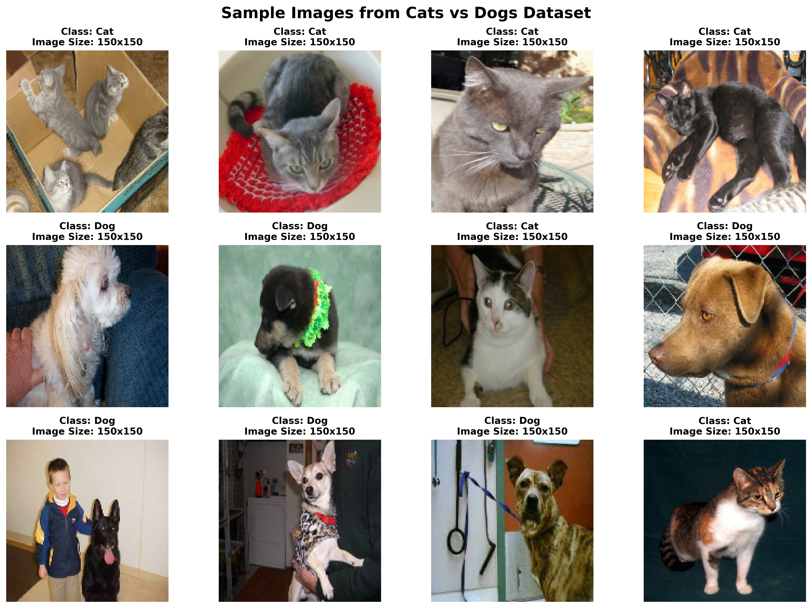
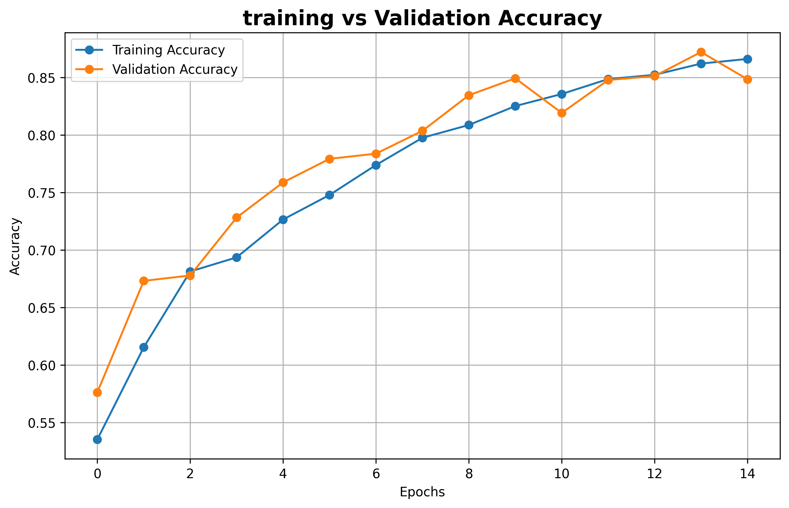
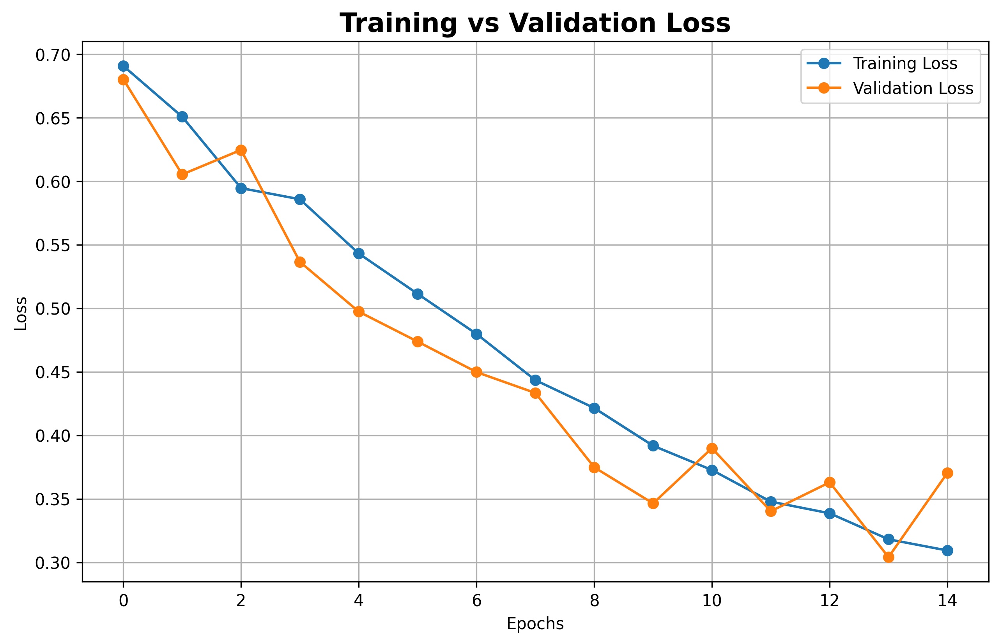
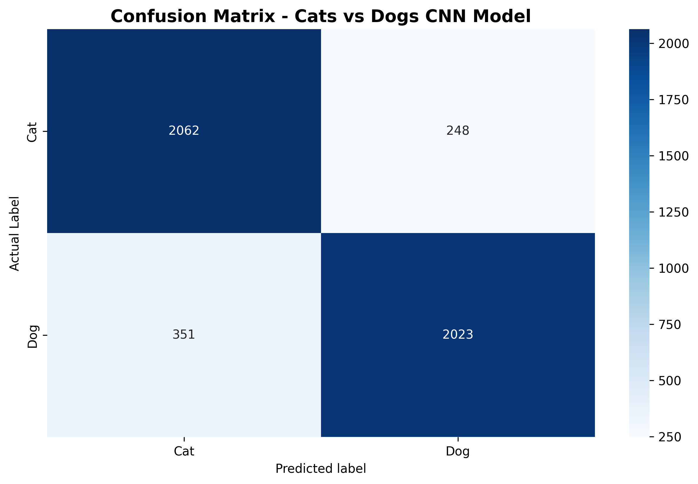

# Cats vs Dogs Image Classification using CNN

## Project Overview

This project is an end-to-end Deep Learning image classification project that classifies images as either **Cat** or **Dog** using a Convolutional Neural Network (CNN).

The project follows an industry-style deep learning workflow including dataset loading, preprocessing, data augmentation, CNN model building, training, evaluation, confusion matrix analysis, single image prediction, and model saving/loading.

---

## Business Problem

In real-world applications, image classification can be used to automatically identify and label pet images.

This type of model can be used in:

- Pet identification applications
- Animal shelter image tagging systems
- Veterinary image classification
- Automated image labeling platforms

---

## Problem Type

This is a **Binary Image Classification** problem.

Classes:

- Cat
- Dog

---

## Dataset Information

The dataset contains images of cats and dogs.

Dataset split:

- Training Images: 18,738
- Validation Images: 4,684
- Total Images: 23,422

---

## Technologies Used

- Python
- TensorFlow
- Keras
- NumPy
- Matplotlib
- Seaborn
- Scikit-learn
- Kaggle Notebook
- GitHub

---

## Project Workflow

1. Project Introduction
2. Dataset Path Verification
3. Dataset Loading
4. Class Name Verification
5. Sample Image Visualization
6. Dataset Performance Optimization
7. Data Augmentation
8. CNN Model Architecture
9. Model Compilation
10. Training with Epochs
11. Accuracy and Loss Analysis
12. Final Model Evaluation
13. Confusion Matrix
14. Classification Report
15. Single Image Prediction
16. Save and Load Model

---

## Sample Images

The dataset contains both Cat and Dog images resized to 150x150 pixels for model training.

---

## CNN Model Architecture

The model was built using a custom CNN architecture.

Main layers used:

- Input Layer
- Data Augmentation Layer
- Rescaling Layer
- Conv2D Layers
- MaxPooling2D Layers
- Flatten Layer
- Dense Layer
- Dropout Layer
- Sigmoid Output Layer

The CNN model learns visual features such as:

- Edges
- Eyes
- Ears
- Fur texture
- Face shape
- Body patterns

---

## Model Training

The model was trained for a total of **15 epochs**.

Industry-level techniques used:

- Data Augmentation
- Dropout Regularization
- EarlyStopping
- ModelCheckpoint
- Validation Monitoring

---

## Accuracy Analysis

The training and validation accuracy improved consistently during training.

Final result:

- Training Accuracy: 86.61%
- Validation Accuracy: 87.21%

---

## Loss Analysis

The training loss and validation loss decreased during training, showing that the model learned effectively.

Final result:

- Validation Loss: 0.3041

---

## Final Model Evaluation

The trained CNN model achieved:

| Metric | Score |
|---|---|
| Validation Accuracy | 87.21% |
| Validation Loss | 0.3041 |

This shows that the model performs well on unseen validation images.

---

## Classification Report

The model achieved balanced performance for both Cat and Dog classes.

| Class | Precision | Recall | F1-Score |
|---|---:|---:|---:|
| Cat | 0.85 | 0.89 | 0.87 |
| Dog | 0.89 | 0.85 | 0.87 |

Overall Accuracy: **87%**

---

## Confusion Matrix

The model correctly classified most Cat and Dog images.

Confusion matrix result:

- Correct Cat Predictions: 2062
- Correct Dog Predictions: 2023
- Cat predicted as Dog: 248
- Dog predicted as Cat: 351

---

## Single Image Prediction

The trained model was tested on individual Cat and Dog images.

The model successfully predicted single images with high confidence, showing that it can be used in a real-world application where a user uploads one image and the system predicts whether it is a Cat or Dog.

---

## Model Saving and Loading

The final trained model was saved using Keras format:

python
cats_vs_dogs_custom_cnn_model.keras

 # Final Project Analysis

The custom CNN model performed well for a binary image classification task.

The model achieved strong validation accuracy and showed balanced performance between Cat and Dog classes.

The use of data augmentation, dropout, early stopping, and model checkpointing helped improve model generalization and reduce overfitting.

This project demonstrates a complete deep learning workflow suitable for a beginner-to-intermediate level computer vision portfolio project.

## Author

**Shubhanshu Boyat**  
AI/ML & Deep Learning Learner

- GitHub: [shubhanshuboyat](https://github.com/shubhanshuboyat)
- LinkedIn: [shubhanshu-boyat](https://www.linkedin.com/in/shubhanshu-boyat)

---
